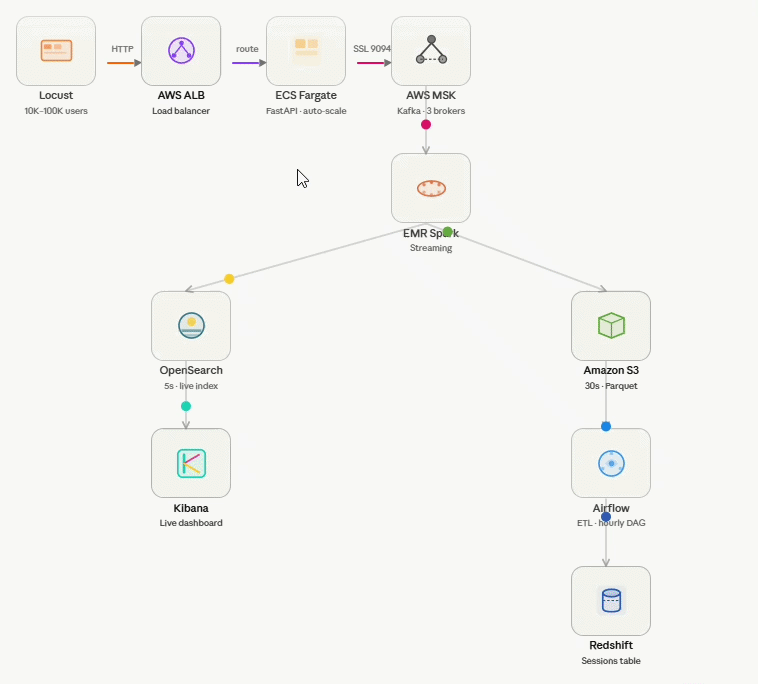
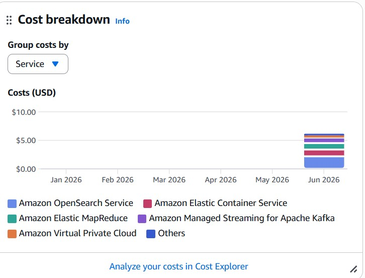
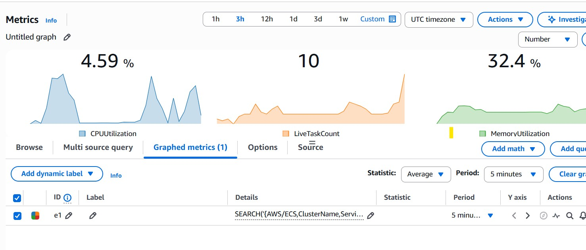
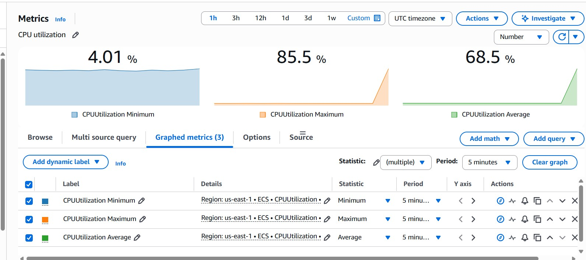
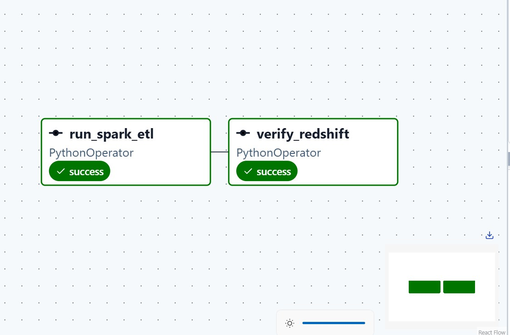
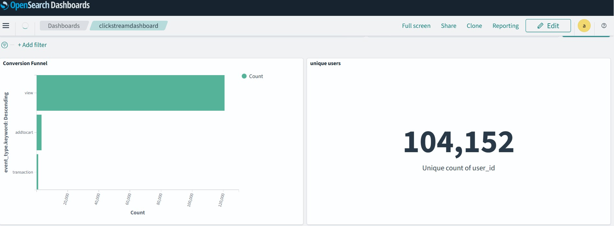

# Clickstream Data Pipeline

> Real-time clickstream ingestion, stream processing, and analytics on AWS — handling 10K–100K concurrent users with zero-downtime auto-scaling.



---

## 📺 Demo Video

[](http://youtube.com/watch?v=nh1S8hemzo4)

---

## Table of Contents

- [Architecture Overview](#architecture-overview)
- [Tech Stack](#tech-stack)
- [Why Each Component](#why-each-component)
- [AWS Infrastructure](#aws-infrastructure)
- [Local Setup](#local-setup)
- [Running the Pipeline](#running-the-pipeline)
- [Auto-Scaling Deep Dive](#auto-scaling-deep-dive)
- [Spark Streaming Job](#spark-streaming-job)
- [Airflow ETL Pipeline](#airflow-etl-pipeline)
- [OpenSearch & Kibana Dashboard](#opensearch--kibana-dashboard)
- [Redshift Analytics](#redshift-analytics)
- [Load Testing with Locust](#load-testing-with-locust)
- [All Commands Reference](#all-commands-reference)
- [Cost Considerations](#cost-considerations)
- [Portfolio Notes](#portfolio-notes)

---

## Architecture Overview

```
Locust (10K–100K users)
        │
        ▼  HTTP POST /ingest
   AWS ALB (Application Load Balancer)
        │
        ▼  distributes traffic
   ECS Fargate (FastAPI, 2–10 tasks, auto-scales)
        │
        ▼  SSL port 9094
   AWS MSK (Kafka, 3 brokers, topic: clickstream)
        │
        ▼  subscribe
   EMR Serverless (Spark Streaming)
        ├──► OpenSearch (5s micro-batch) ──► Kibana Dashboard
        └──► S3 Parquet (30s batch)
                │
                ▼  hourly
           Airflow DAG (ETL: sessionize + score)
                │
                ▼
           Redshift Serverless (clickstream_sessions table)
```

**Data volume:** 107,811 requests / 2 minutes @ 10K users, 0 failures after auto-scaling to 10 tasks.

---

## Tech Stack

| Layer | Technology | Why |
|---|---|---|
| Load generation | Locust | Python-native, realistic user simulation |
| Ingestion API | FastAPI + Gunicorn | Async, fire-and-forget Kafka writes |
| Container orchestration | ECS Fargate | Serverless containers, no EC2 management |
| Load balancer | AWS ALB | HTTP/HTTPS, request-count-based auto-scaling |
| Message broker | AWS MSK (Kafka) | Durable, replayable, 3-broker HA |
| Stream processing | EMR Serverless Spark | Managed Spark, no cluster ops |
| Object storage | Amazon S3 | Cheap, durable Parquet landing zone |
| Search & analytics | OpenSearch + Kibana | Real-time dashboards, 5s refresh |
| Workflow orchestration | Apache Airflow | DAG-based ETL, hourly scheduling |
| Data warehouse | Redshift Serverless | SQL analytics, sessionized data |

---

## Why Each Component

### Why ECS Fargate (not EC2, not Lambda)?

ECS Fargate runs Docker containers without you managing servers. Compared to alternatives:

- **vs EC2:** No patching, no capacity planning. You define CPU/memory per task; AWS handles the rest.
- **vs Lambda:** FastAPI with persistent Kafka connections is not a good fit for Lambda's stateless ephemeral model. Fargate keeps the connection pool alive across requests.
- **vs ECS on EC2:** Fargate charges per task-second. For bursty traffic (0 → 10K users), you only pay when tasks are running.

Each Fargate task runs Gunicorn with 16 workers, handling ~700 concurrent requests. At 10K users, ALB distributes across 10 tasks = 160 workers total.

### Why ALB (not NLB, not API Gateway)?

ALB operates at Layer 7 (HTTP). This matters because:

- ALB can route based on path (`/ingest`), headers, and query strings.
- ALB exposes `RequestCountPerTarget` — the exact metric used for our auto-scaling policy. NLB works at Layer 4 (TCP) and doesn't expose this metric.
- API Gateway adds latency and cost per million requests. ALB is flat-rate and faster for high-throughput ingest.

### Why AWS MSK (Kafka)?

Kafka decouples ingestion from processing. Without Kafka:

- If Spark is slow or down, events are lost.
- You can't replay events for reprocessing or debugging.
- Multiple consumers (OpenSearch + S3) would require the FastAPI app to write to both — tight coupling.

MSK gives us a managed 3-broker cluster with SSL, replication factor 3 — every message is written to 3 brokers before ack. Even if one broker dies, no data loss.

### Why EMR Serverless Spark (not Kinesis, not Flink)?

Spark Structured Streaming is the industry standard for large-scale stream processing. EMR Serverless means:

- No cluster to manage — submit a job, AWS provisions workers automatically.
- VPC-native — can reach MSK brokers on private subnets.
- `--execution-timeout-minutes 0` means the job runs forever (streaming).

Kinesis Data Analytics (Flink) is an alternative but requires learning Flink APIs. Spark SQL is more familiar for analytics engineers.

### Why Redshift (not Athena, not BigQuery)?

Redshift Serverless is the right choice for:

- **Historical session queries** — "show me sessions where engagement > 0.8 last week". Athena on S3 works too but is slower for repeated queries on the same data.
- **SQL compatibility** — standard SQL, JDBC connection, works with any BI tool.
- **Serverless** — no cluster to manage, charges per RPU-hour of actual query time.

Athena is better if you never re-query the same data. Redshift is better for dashboards and recurring analytical queries.

### Why Airflow (not AWS Glue, not Step Functions)?

Airflow gives you a visual DAG, retry logic, SLA monitoring, and a rich operator ecosystem. Our ETL DAG:

1. Reads Parquet from S3
2. Sessionizes events (30-minute inactivity window)
3. Scores engagement (page views, add-to-cart, purchase events weighted)
4. Writes sessions to Redshift via JDBC

AWS Glue would work but costs more per DPU-hour and has less flexibility. Step Functions is better for microservice orchestration, not data pipelines.

---

## AWS Infrastructure

### Resources Created

| Resource | Name / ID | Region |
|---|---|---|
| S3 Bucket | `clickstream-pipeline` | us-east-1 |
| MSK Cluster | `clickstream-kafka` | us-east-1 |
| MSK Brokers | `b-1,b-2,b-3.clickstreamkafka.0luxcu.c6.kafka.us-east-1.amazonaws.com:9094` | us-east-1 |
| ECS Cluster | `clickstream-cluster` | us-east-1 |
| ECS Service | `clickstream-fastapi-service` | us-east-1 |
| ECR Repo | `155409188308.dkr.ecr.us-east-1.amazonaws.com/clickstream-fastapi` | us-east-1 |
| ALB | `clickstream-alb-1631464060.us-east-1.elb.amazonaws.com` | us-east-1 |
| OpenSearch | `search-clickstream-j3glehr2glclhpparfwtmi5mte.us-east-1.es.amazonaws.com` | us-east-1 |
| Redshift Serverless | `clickstream-workgroup` | ap-southeast-2 |
| EMR Serverless App | `clickstream-spark` (ID: `00g687l6tffeq309`) | us-east-1 |
| VPC | `vpc-0396339c912ba6fec` | us-east-1 |

### IAM Roles

- `clickstream-ecs-role` — ECS task role (S3, MSK, CloudWatch)
- `clickstream-emr-role` — EMR Serverless execution role (S3, MSK, OpenSearch, Redshift)
- `clickstream-redshift-role` — Redshift S3 access

### AWS Cost Overview



---

## Local Setup

### Prerequisites

- Python 3.12
- Docker
- AWS CLI configured
- Java 11+ (for local Kafka)

### Install

```bash
git clone https://github.com/shan1322/clickstream-data-pipeline.git
cd clickstream-data-pipeline
python -m venv venv
source venv/bin/activate
pip install -e ".[api,simulator,etl,orchestration]"
```

### Environment Variables

Copy `.env` and fill in values:

```bash
cp .env.example .env
```

Key variables:

```dotenv
# Local Kafka (for local dev)
KAFKA_BROKER=localhost:9092
KAFKA_TOPIC=clickstream

# AWS MSK (for production)
MSK_BROKER=b-1.clickstreamkafka...amazonaws.com:9094,b-2...,b-3...

# S3
S3_BUCKET=s3://clickstream-pipeline/parquet/

# OpenSearch
OPENSEARCH_HOST=search-clickstream-...es.amazonaws.com
OPENSEARCH_PORT=443
OPENSEARCH_USER=admin
OPENSEARCH_PASSWORD=<your-password>

# Redshift
REDSHIFT_HOST=clickstream-workgroup....redshift-serverless.amazonaws.com
REDSHIFT_PORT=5439
REDSHIFT_DB=dev
REDSHIFT_USER=admin
REDSHIFT_PASSWORD=<your-password>

# EMR
EMR_APPLICATION_ID=00g687l6tffeq309
AWS_DEFAULT_REGION=us-east-1
```

### Start Local Stack

```bash
# Start local Kafka
./start_local.sh

# Start FastAPI locally
cd fastapi_app
uvicorn main:app --reload --port 8000
```

---

## Running the Pipeline

### 1. Deploy FastAPI to ECS

```bash
# Build and push Docker image
docker build -t clickstream-fastapi ./fastapi_app/
docker tag clickstream-fastapi:latest 155409188308.dkr.ecr.us-east-1.amazonaws.com/clickstream-fastapi:latest
aws ecr get-login-password --region us-east-1 | docker login --username AWS --password-stdin 155409188308.dkr.ecr.us-east-1.amazonaws.com
docker push 155409188308.dkr.ecr.us-east-1.amazonaws.com/clickstream-fastapi:latest

# Force new deployment
aws ecs update-service \
    --cluster clickstream-cluster \
    --service clickstream-fastapi-service \
    --force-new-deployment \
    --region us-east-1
```

### 2. Start Spark Streaming on EMR

```bash
set -a; source .env; set +a

aws emr-serverless start-job-run \
    --application-id 00g687l6tffeq309 \
    --execution-role-arn arn:aws:iam::155409188308:role/clickstream-emr-role \
    --execution-timeout-minutes 0 \
    --job-driver "{
        \"sparkSubmit\": {
            \"entryPoint\": \"s3://clickstream-pipeline/scripts/spark_streaming.py\",
            \"entryPointArguments\": [
                \"KAFKA_BROKER=$MSK_BROKER\",
                \"KAFKA_TOPIC=clickstream\",
                \"S3_BUCKET=s3://clickstream-pipeline/parquet/\",
                \"AWS_DEFAULT_REGION=us-east-1\",
                \"OPENSEARCH_HOST=$OPENSEARCH_HOST\",
                \"OPENSEARCH_PORT=$OPENSEARCH_PORT\",
                \"OPENSEARCH_USER=$OPENSEARCH_USER\",
                \"OPENSEARCH_PASSWORD=$OPENSEARCH_PASSWORD\"
            ],
            \"sparkSubmitParameters\": \"--jars s3://clickstream-pipeline/jars/opensearch-spark-30_2.12-1.1.0.jar,s3://clickstream-pipeline/jars/spark-sql-kafka-0-10_2.12-3.4.1.jar,s3://clickstream-pipeline/jars/spark-token-provider-kafka-0-10_2.12-3.4.1.jar,s3://clickstream-pipeline/jars/kafka-clients-3.3.2.jar,s3://clickstream-pipeline/jars/commons-pool2-2.11.1.jar\"
        }
    }" \
    --configuration-overrides '{
        "monitoringConfiguration": {
            "s3MonitoringConfiguration": {
                "logUri": "s3://clickstream-pipeline/logs/"
            }
        }
    }' \
    --region us-east-1
```

### 3. Check Spark Job Status

```bash
aws emr-serverless list-job-runs \
    --application-id 00g687l6tffeq309 \
    --region us-east-1 \
    --query "jobRuns[0].{state:state,details:stateDetails}"
```

### 4. Check Spark Logs

```bash
JOB_ID=$(aws emr-serverless list-job-runs \
    --application-id 00g687l6tffeq309 \
    --region us-east-1 \
    --query "jobRuns[0].id" --output text)

aws s3 cp s3://clickstream-pipeline/logs/applications/00g687l6tffeq309/jobs/$JOB_ID/SPARK_DRIVER/stderr.gz - | gunzip | tail -50
```

### 5. Cancel Spark Job

```bash
aws emr-serverless cancel-job-run \
    --application-id 00g687l6tffeq309 \
    --job-run-id <JOB_RUN_ID> \
    --region us-east-1
```

### 6. Run Load Test

```bash
cd simulator
locust -f traffic_simulator.py \
    --host=http://clickstream-alb-1631464060.us-east-1.elb.amazonaws.com \
    --users 10000 \
    --spawn-rate 100 \
    --run-time 120s \
    --headless
```

### 7. Run Airflow ETL Locally

```bash
# Start Airflow
export AIRFLOW_HOME=./airflow
airflow db init
airflow webserver --port 8080 &
airflow scheduler &

# Trigger DAG manually
airflow dags trigger clickstream_etl
```

---

## Auto-Scaling Deep Dive

### How It Works

Auto-scaling is configured on the ECS service using ALB `RequestCountPerTarget` instead of CPU.

**Why not CPU?** FastAPI with Gunicorn is I/O bound — writing to Kafka is network I/O, not CPU computation. Under 10,000 concurrent users, CPU stays at ~4% while threads exhaust. CPU-based scaling would never trigger.

**Why RequestCountPerTarget?** When requests-per-task exceed 1,000, ALB signals ECS to add tasks. This directly measures actual load on the application.

### Auto-Scaling in Action





### Auto-Scaling Policy

```bash
aws application-autoscaling put-scaling-policy \
    --service-namespace ecs \
    --resource-id service/clickstream-cluster/clickstream-fastapi-service \
    --scalable-dimension ecs:service:DesiredCount \
    --policy-name clickstream-request-scaling \
    --policy-type TargetTrackingScaling \
    --target-tracking-scaling-policy-configuration '{
        "TargetValue": 1000.0,
        "PredefinedMetricSpecification": {
            "PredefinedMetricType": "ALBRequestCountPerTarget",
            "ResourceLabel": "app/clickstream-alb/871aeef0a5f3b4fb/targetgroup/clickstream-tg/4997184546af1884"
        },
        "ScaleInCooldown": 300,
        "ScaleOutCooldown": 60
    }' \
    --region us-east-1
```

### Scaling Behavior Observed

| Users | Tasks | Req/s | Failures |
|---|---|---|---|
| 0 | 2 (min) | 0 | 0 |
| 10,000 burst | 2 → 10 | ~700 | 149 (during scale-up) |
| 10,000 steady | 10 | ~700 | 0 |

Scale-out cooldown is 60 seconds — new tasks start in ~90 seconds from trigger. Scale-in cooldown is 300 seconds to avoid thrashing.

### Check Current Task Count

```bash
aws ecs describe-services \
    --cluster clickstream-cluster \
    --services clickstream-fastapi-service \
    --region us-east-1 \
    --query "services[0].{running:runningCount,desired:desiredCount}"
```

### Watch Tasks in Real Time (run alongside Locust)

```bash
watch -n 10 "aws ecs describe-services \
    --cluster clickstream-cluster \
    --services clickstream-fastapi-service \
    --region us-east-1 \
    --query 'services[0].{running:runningCount,desired:desiredCount}'"
```

---

## Spark Streaming Job

### What It Does

`spark/spark_streaming.py` reads from MSK Kafka topic `clickstream` and writes to two sinks in parallel:

**Sink 1 — S3 (batch every 30 seconds):**

- Parquet format, partitioned by `event_type`
- Checkpoints at `s3a://clickstream-pipeline/parquet/_checkpoint`
- Used by Airflow for hourly ETL to Redshift

**Sink 2 — OpenSearch (micro-batch every 5 seconds):**

- Index: `clickstream`
- Used by Kibana for live dashboards
- Checkpoints at `s3a://clickstream-pipeline/parquet/_os_checkpoint`

### Event Schema

```python
schema = StructType([
    StructField("user_id",    IntegerType()),
    StructField("item_id",    IntegerType()),
    StructField("event_type", StringType()),   # page_view, add_to_cart, purchase
    StructField("timestamp",  LongType()),
    StructField("session_id", StringType())
])
```

### Jars Required

All pre-downloaded to `s3://clickstream-pipeline/jars/`:

| Jar | Version | Purpose |
|---|---|---|
| `spark-sql-kafka-0-10_2.12` | 3.4.1 | Kafka source connector |
| `spark-token-provider-kafka-0-10_2.12` | 3.4.1 | Kafka auth tokens |
| `kafka-clients` | 3.3.2 | Kafka client library |
| `commons-pool2` | 2.11.1 | Connection pooling for Kafka |
| `opensearch-spark-30_2.12` | 1.1.0 | OpenSearch sink connector |

**Why pre-download jars?** EMR Serverless runs in a VPC with no internet access. `--packages` downloads from Maven Central which is unreachable. Pre-staging to S3 and using `--jars` is the correct pattern.

---

## Airflow ETL Pipeline

### DAG: `clickstream_etl`

**Schedule:** Hourly (`0 * * * *`)

**Tasks:**

1. `run_spark_etl` — submits `etl/etl_job.py` to Spark (local mode)
2. `verify_redshift` — checks row count in `clickstream_sessions`

### Airflow DAG — Both Tasks SUCCESS



### What the ETL Does

`etl/etl_job.py` reads Parquet from S3, applies sessionization, and writes to Redshift:

**Sessionization logic:**

- Events within a 30-minute inactivity window belong to the same session
- Session boundary = gap > 30 minutes between events for same `user_id`

**Engagement scoring:**

```python
# Weighted event scoring
engagement = (
    page_views    * 1.0 +
    add_to_cart   * 3.0 +
    purchases     * 10.0
) / session_duration_minutes
```

**Output schema in Redshift (`clickstream_sessions`):**

```sql
CREATE TABLE clickstream_sessions (
    session_id                VARCHAR(36),
    user_id                   INTEGER,
    session_start             TIMESTAMP,
    session_end               TIMESTAMP,
    session_duration_seconds  FLOAT,
    view_count                INTEGER,
    addtocart_count           INTEGER,
    transaction_count         INTEGER,
    total_events              INTEGER
);
```

### Trigger ETL Manually

```bash
airflow dags trigger clickstream_etl
```

### Check Redshift Row Count

```bash
aws redshift-data execute-statement \
    --workgroup-name clickstream-workgroup \
    --database dev \
    --sql "SELECT COUNT(*) FROM clickstream_sessions" \
    --region ap-southeast-2
```

### Why Airflow for ETL (not a cron job)?

- Visual DAG in UI — see which tasks passed/failed at a glance
- Automatic retries on failure (configurable per task)
- SLA alerts — know when an hourly job is late
- Backfill — if the pipeline was down, re-run historical hours with one command

```bash
# Backfill missed runs
airflow dags backfill clickstream_etl \
    --start-date 2026-06-01 \
    --end-date 2026-06-06
```

---

## OpenSearch & Kibana Dashboard

### Index

- **Name:** `clickstream`
- **Documents:** 153,826+ (grows with every Locust run)
- **Refresh:** Kibana dashboard set to auto-refresh every 5 seconds

### Kibana Live Dashboard



### Check Document Count

```bash
curl -u "admin:<password>" \
    "https://search-clickstream-j3glehr2glclhpparfwtmi5mte.us-east-1.es.amazonaws.com/clickstream/_count"
```

### Check Index Health

```bash
curl -u "admin:<password>" \
    "https://search-clickstream-j3glehr2glclhpparfwtmi5mte.us-east-1.es.amazonaws.com/_cluster/health?pretty"
```

### Dashboard Visualizations

1. **Event type breakdown** — pie chart of `page_view` / `add_to_cart` / `purchase`
2. **Events over time** — line chart, 10-second buckets
3. **Unique users** — cardinality aggregation on `user_id`
4. **Top items** — bar chart of most-viewed `item_id`

---

## Redshift Analytics

### Verify Data Loaded

```sql
SELECT COUNT(*) FROM clickstream_sessions;
-- 17,907 sessions after first ETL run
```

### Sample Analytics Queries

```sql
-- Top 10 users by purchases
SELECT user_id,
       COUNT(*) as total_sessions,
       AVG(session_duration_seconds) as avg_duration,
       SUM(transaction_count) as total_purchases,
       SUM(addtocart_count) as total_atc,
       SUM(view_count) as total_views
FROM clickstream_sessions
GROUP BY user_id
ORDER BY total_purchases DESC
LIMIT 10;

-- Session duration distribution
SELECT
    CASE
        WHEN session_duration_seconds < 60   THEN '< 1 min'
        WHEN session_duration_seconds < 300  THEN '1-5 min'
        WHEN session_duration_seconds < 1800 THEN '5-30 min'
        ELSE '> 30 min'
    END AS bucket,
    COUNT(*) as sessions
FROM clickstream_sessions
GROUP BY 1
ORDER BY 2 DESC;

-- Conversion funnel
SELECT
    SUM(view_count)        as total_views,
    SUM(addtocart_count)   as total_atc,
    SUM(transaction_count) as total_purchases,
    ROUND(100.0 * SUM(transaction_count) / NULLIF(SUM(view_count), 0), 2) as conversion_rate
FROM clickstream_sessions;
```

---

## Load Testing with Locust

### Run 10,000 Users (headless)

```bash
cd simulator
locust -f traffic_simulator.py \
    --host=http://clickstream-alb-1631464060.us-east-1.elb.amazonaws.com \
    --users 10000 \
    --spawn-rate 100 \
    --run-time 120s \
    --headless
```

### Run with UI

```bash
cd simulator
locust -f traffic_simulator.py \
    --host=http://clickstream-alb-1631464060.us-east-1.elb.amazonaws.com
# Open http://localhost:8089
```

### Run 100,000 Users (distributed)

```bash
# Master
locust -f traffic_simulator.py \
    --host=http://clickstream-alb-1631464060.us-east-1.elb.amazonaws.com \
    --master --users 100000 --spawn-rate 500

# Worker (run in separate terminals)
locust -f traffic_simulator.py --worker --master-host localhost
```

### Results Observed

| Metric | Value |
|---|---|
| Total requests | 107,811 |
| Failures | 149 (0.14%) — all during initial scale-up |
| Median response time | 550ms |
| 95th percentile | 800ms |
| Peak req/s | ~997 |
| Final task count | 10 (auto-scaled from 2) |

---

## All Commands Reference

### ECS

```bash
# Check service status
aws ecs describe-services \
    --cluster clickstream-cluster \
    --services clickstream-fastapi-service \
    --region us-east-1 \
    --query "services[0].{running:runningCount,desired:desiredCount}"

# Force redeploy
aws ecs update-service \
    --cluster clickstream-cluster \
    --service clickstream-fastapi-service \
    --force-new-deployment \
    --region us-east-1

# Watch tasks live
watch -n 10 "aws ecs describe-services \
    --cluster clickstream-cluster \
    --services clickstream-fastapi-service \
    --region us-east-1 \
    --query 'services[0].{running:runningCount,desired:desiredCount}'"
```

### MSK

```bash
# List clusters
aws kafka list-clusters --region us-east-1

# Get broker endpoints
aws kafka get-bootstrap-brokers \
    --cluster-arn arn:aws:kafka:us-east-1:155409188308:cluster/clickstream-kafka/3d146113-b677-4d17-ab59-c6a2e6b75fd1-6 \
    --region us-east-1
```

### EMR Serverless

```bash
# List job runs
aws emr-serverless list-job-runs \
    --application-id 00g687l6tffeq309 \
    --region us-east-1 \
    --query "jobRuns[*].{id:id,state:state}"

# Cancel job
aws emr-serverless cancel-job-run \
    --application-id 00g687l6tffeq309 \
    --job-run-id <JOB_ID> \
    --region us-east-1

# Stop application
aws emr-serverless stop-application \
    --application-id 00g687l6tffeq309 \
    --region us-east-1
```

### S3

```bash
# Check parquet files
aws s3 ls s3://clickstream-pipeline/parquet/ --recursive | wc -l

# Check jars
aws s3 ls s3://clickstream-pipeline/jars/

# Upload updated script
aws s3 cp spark/spark_streaming.py s3://clickstream-pipeline/scripts/spark_streaming.py
```

### OpenSearch

```bash
# Document count
curl -u "admin:<password>" \
    "https://search-clickstream-j3glehr2glclhpparfwtmi5mte.us-east-1.es.amazonaws.com/clickstream/_count"

# Delete index (reset)
curl -X DELETE -u "admin:<password>" \
    "https://search-clickstream-j3glehr2glclhpparfwtmi5mte.us-east-1.es.amazonaws.com/clickstream"
```

### Shutdown All (save costs)

```bash
# Cancel EMR job
JOB_ID=$(aws emr-serverless list-job-runs --application-id 00g687l6tffeq309 --region us-east-1 --query "jobRuns[?state=='RUNNING'].id" --output text)
aws emr-serverless cancel-job-run --application-id 00g687l6tffeq309 --job-run-id $JOB_ID --region us-east-1

# Stop EMR application
aws emr-serverless stop-application --application-id 00g687l6tffeq309 --region us-east-1

# Scale ECS to 0
aws ecs update-service --cluster clickstream-cluster --service clickstream-fastapi-service --desired-count 0 --region us-east-1

# Delete OpenSearch (can't pause)
aws opensearch delete-domain --domain-name clickstream --region us-east-1

# Delete MSK
aws kafka delete-cluster --cluster-arn <CLUSTER_ARN> --region us-east-1

# Delete Redshift
aws redshift-serverless delete-workgroup --workgroup-name clickstream-workgroup --region ap-southeast-2
aws redshift-serverless delete-namespace --namespace-name clickstream-namespace --region ap-southeast-2
```

---

## Cost Considerations


All resources are on minimal paid tier for demo purposes:

- **ECS Fargate:** ~$0.04/vCPU-hour. 2 tasks idle ≈ $1.50/day.
- **MSK:** `kafka.t3.small` × 3 brokers ≈ $1.20/day.
- **EMR Serverless:** Charged only when job runs. ~$0.052/vCPU-hour.
- **OpenSearch:** `t3.small.search` × 1 node ≈ $0.86/day.
- **Redshift Serverless:** Charged per RPU-hour of queries. Minimal for demo.
- **S3:** < $0.01/day for demo data volumes.

---

## Portfolio Notes

This project demonstrates end-to-end production data engineering:

- **Real-time ingestion** at 10K–100K users with auto-scaling
- **Stream processing** with Spark on managed EMR — two concurrent output streams
- **Operational analytics** via OpenSearch + Kibana with 5-second refresh
- **Batch ETL** via Airflow — sessionization, engagement scoring, Redshift load

**GitHub:** [shan1322/clickstream-data-pipeline](https://github.com/shan1322/clickstream-data-pipeline)

**YouTube Demo:** [Watch → @shantanuds06](https://www.youtube.com/@shantanuds06)